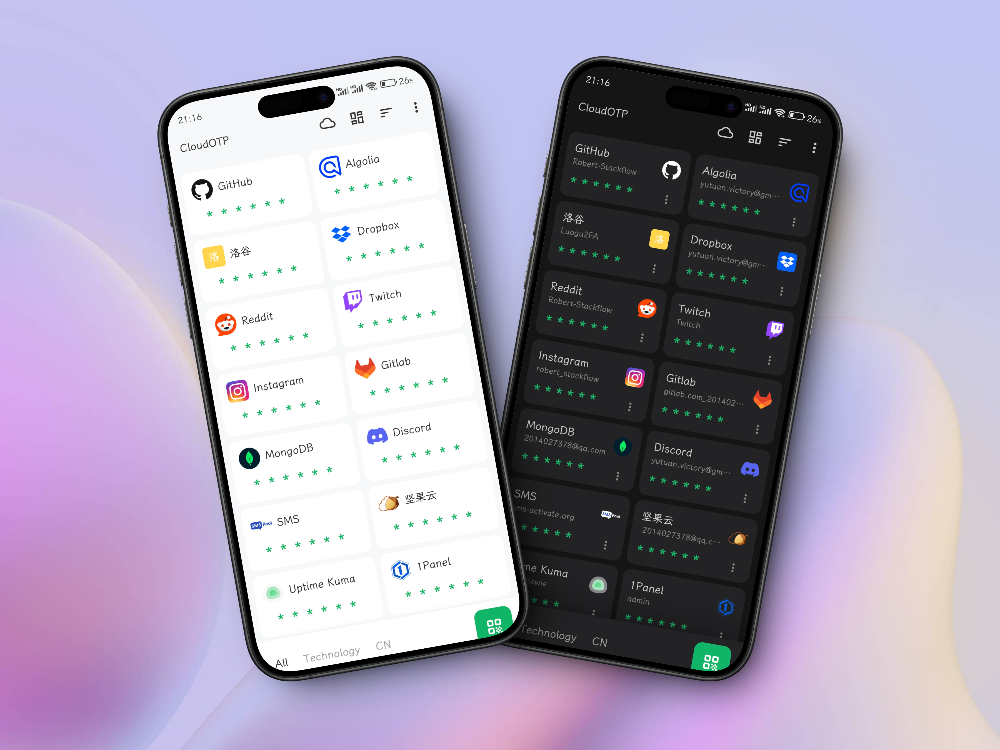
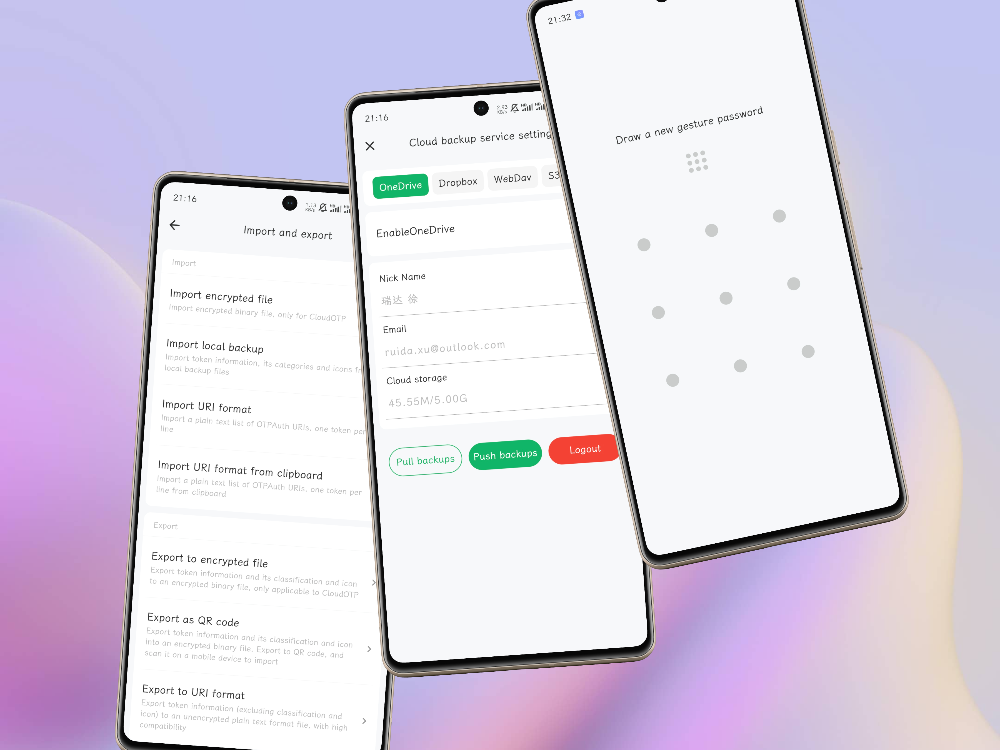

# 欢迎使用CloudOTP👏!

CloudOTP是一款基于Flutter的双因素验证器，支持Android和Windows平台，支持云备份。

  
   
  
  
     
    
    

## 功能特性

- 基于Flutter架构重构，支持Android和Windows，未来将逐步支持更多平台
- 支持TOTP、HOTP、MOTP、Steam、Yandex
- 支持扫码添加、识别图片、手动输入密钥
- 支持自定义图标和分类、支持排序和多种令牌布局
- 支持深色模式、多种语言、多种主题
- 支持本地备份和自动备份、支持WebDav、Onedrive、GoogleDrive、Dropbox、S3存储等多种云备份方式
- 支持导入/导出加密文件、URI列表
- 支持数据库加密、手势密码、指纹解锁

## Android端预览

## Windows端预览

